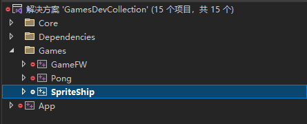
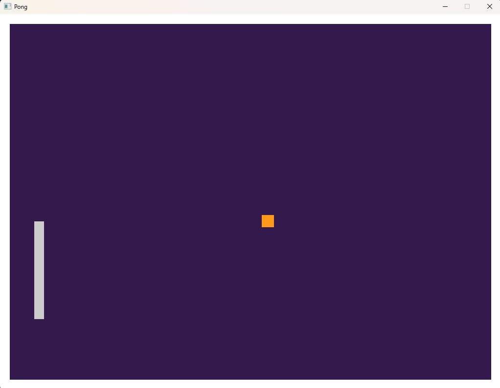
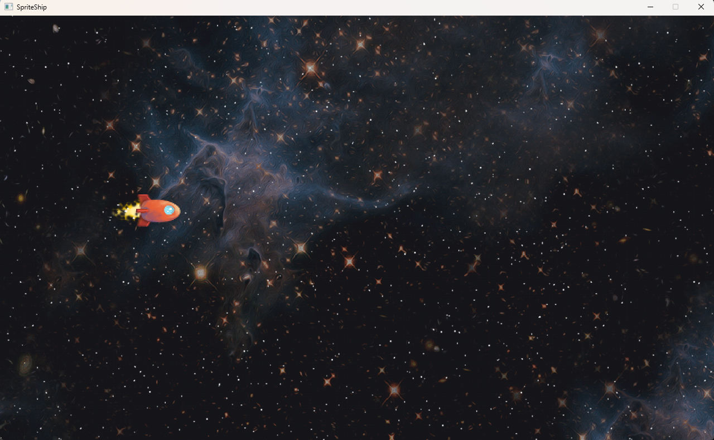

# C++游戏开发合集（更新中）

## 启动

1. 直接clone工程或者下载即可
2. 打开`Script/`文件夹
3. 运行`Setup-Windows.bat` 
4. 在根目录会生成`GamesDevCollection.sln`文件和`settings/`文件夹
5. 使用Visual Studio 2022打开`GamesDevCollection.sln`
6. 将`Game`下的任一游戏设置为启动项（后期更新将会集成到一起）
    
    
    
7. 编译即可运行

## 目录

1. Pong
    
    
    
2. Sprite Ship
    
    